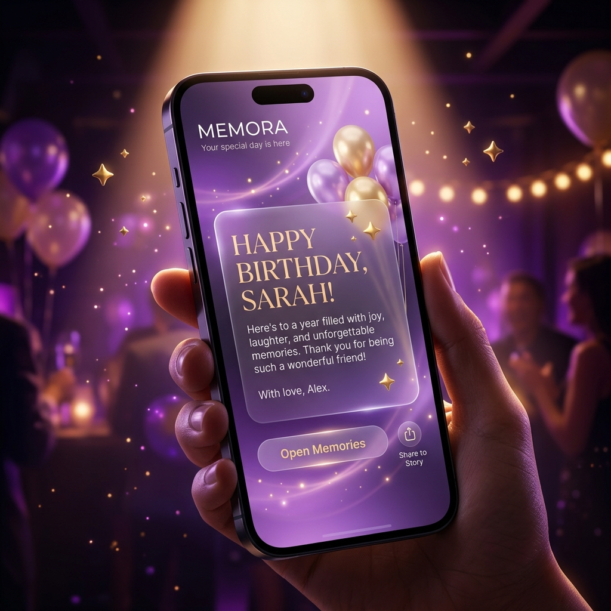

# 🌌 Memora — Cinematic Birthday Microsite Generator

> A premium, immersive, and highly animated birthday curation platform. Inspired by Apple product pages, Spotify Wrapped, and luxurious cinematic portfolios.



## ✨ What is Memora?

Memora is **not** your typical greeting card website. It is an ultra-premium web application that allows creators to build highly emotional, storytelling-focused birthday microsites. With custom animations, dynamic soundscapes, AI-powered wish generation, and custom photo galleries, Memora transforms messages into a theatrical cinematic event.

---

## 🎨 Catalog of 18 Premium Themes

Each theme includes hand-crafted color palettes, responsive layouts, tailored fonts, customized photo frame animations, and unique ambient cinematic background effects.

| # | Theme Name | Key Visual Vibes | Cinematic Background Effect |
|---|------------|------------------|-----------------------------|
| 1 | **Midnight Luxury** | Deep purple, dark neon glow, minimalist | Cosmic neon drift & floating ambient dust |
| 2 | **Memory Lane** | Warm sepia, handwriting, polaroid borders | Authentic vintage film grain flicker effect |
| 3 | **Neon Party** | Cyber EDM, pink-cyan strobe, dancing beats | Vibrant shifting neon flares & pulse |
| 4 | **Minimal Love** | Ivory, clean gold trims, spacious luxury | Slow subtle micro-zoom breathing |
| 5 | **Golden Glimmer** | Emerald velvet, gilded typography | Falling luxury gold dust sparkles |
| 6 | **Retro Pop** | 80s Comic pastel blocks, thick borders | Shadow-block responsive scaling |
| 7 | **Terminal Cyberpunk** | Monospace, matrix green grid, hacker glow | Scanning digital matrix lines overlay |
| 8 | **Classic Stage Surprise**| Opening velvet curtains, fairy lights | Opening theater curtain split & light pulse |
| 9 | **Sweet Sakura** | Cherry blossom pink, cursive serif | Drifting pink petals & soft warm breeze |
| 10 | **Midnight Forest** | Dark emerald, campfire embers | Warm amber sparks drifting upwards |
| 11 | **Galactic Odyssey** | Space explorer, nebula cloud grid | Rotating stellar coordinates & nebula glow |
| 12 | **Sunset Boulevard** | Retro synthwave sunset, palm shadow grids | Bright orange sunset horizon grid waves |
| 13 | **Royal Velvet** | Imperial blue velvet, golden gild frame | Shimmering gilded particles & royal blue aura |
| 14 | **Ocean Breeze** | Coastal mint, seafoam sand dunes | Sweeping teal tide-wave drift gradients |
| 15 | **Disco Fever** | 70s Groovy colorful flares, sparkle balls | Psychedelic purple-orange pulsing lens flare |
| 16 | **Chalkboard Memories** | Blackboard rustic sketch outlines | Floating classroom chalk dust particles |
| 17 | **Comic Pop Art** | Thick comic halftones, action balloons | Stylized pop-art halftone pattern overlay |
| 18 | **Dreamy Cloudscape** | Lavender cloud sky, pastel dreamland | Slowly floating cumulus clouds & dream haze |

---

## 🌟 Major Highlights & Features

- 🎟️ **Theatrical Curtain Opening**: The *Classic Stage* theme opens with a beautiful split-curtain opening animation, setting a theatrical tone.
- 🎈 **Fairy Light & Balloon physics**: Real-time floating balloons rise gently across the screen with randomized float directions and speeds.
- 🤖 **AI Emotional Wish Writer**: Automatically writes deeply personal, emotional, or humorous wishes using integrated AI engines.
- 📱 **Mobile-First Responsive Frames**: Curated to look stunning on iPhones, Android devices, and desktops.
- 🎧 **Dynamic Audio Sync**: Allows creators to attach background tracks (Lo-fi, Cinematic Ambient, Emotional Piano) synced with site transitions.
- 💬 **Direct Recipient Reply**: Integrated with WhatsApp links allowing the recipient to click and reply immediately to the creator.

---

## 🛠️ Technology Stack

- **Core Framework**: React 19 (Next.js App Router)
- **Styling & Theme Engine**: Tailwind CSS (custom utility-first styling)
- **Animations**: Framer Motion (micro-interactions, canvas-less transitions)
- **Database & Auth**: Google Firebase (Firestore Database, Google OAuth, Firebase Auth)
- **State Management**: React Hooks & Contexts
- **Deployment**: Vercel & GitHub CI/CD

---

## 🚀 Setting Up Locally

Ensure you have [Node.js](https://nodejs.org) installed.

1. **Clone the Repository**
   ```bash
   git clone git@github.com:shreyashmane-dev/Mimora.git
   cd Mimora
   ```

2. **Install Dependencies**
   ```bash
   npm install
   ```

3. **Configure Environment Variables**
   Create a `.env` or `.env.local` file in the root directory:
   ```env
   NEXT_PUBLIC_FIREBASE_API_KEY=your_api_key
   NEXT_PUBLIC_FIREBASE_AUTH_DOMAIN=your_auth_domain
   NEXT_PUBLIC_FIREBASE_PROJECT_ID=your_project_id
   NEXT_PUBLIC_FIREBASE_STORAGE_BUCKET=your_storage_bucket
   NEXT_PUBLIC_FIREBASE_MESSAGING_SENDER_ID=your_sender_id
   NEXT_PUBLIC_FIREBASE_APP_ID=your_app_id
   NEXT_PUBLIC_FIREBASE_MEASUREMENT_ID=your_measurement_id
   ```

4. **Run Development Server**
   ```bash
   npm run dev
   ```
   Open [http://localhost:3000](http://localhost:3000) with your browser.

5. **Build for Production**
   ```bash
   npm run build
   ```

---

## 🌐 Deploy to Vercel

The application is fully optimized for one-click deployment on the **Vercel Platform**:

1. Push your latest code changes to your GitHub branch.
2. Link your repository inside the Vercel Dashboard.
3. Configure the Firebase environment variables in Vercel.
4. Click **Deploy**!

---

*Curated with ❤️ by the Memora Development Team.*
